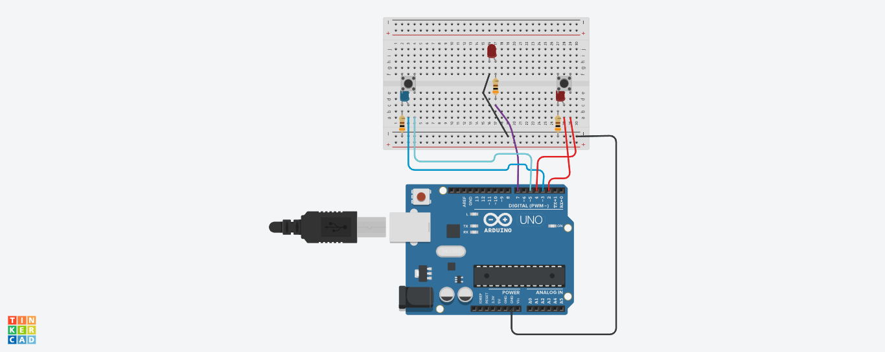
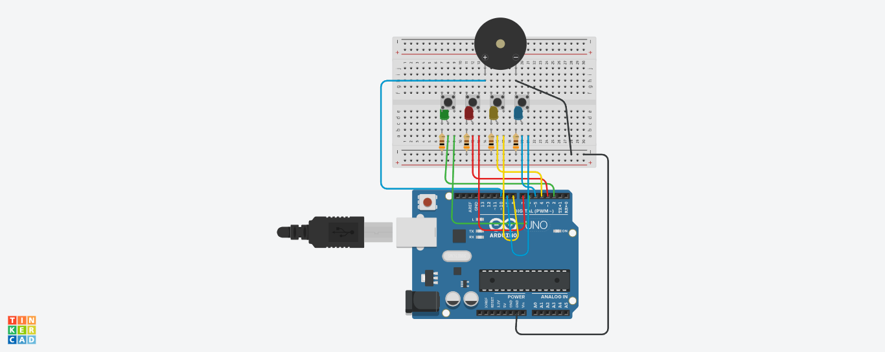
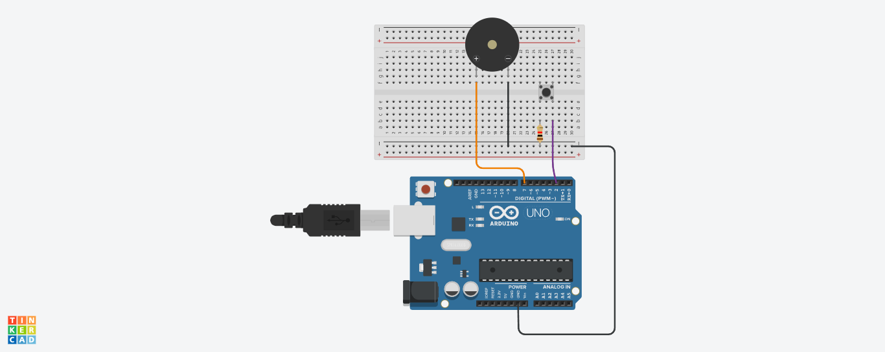
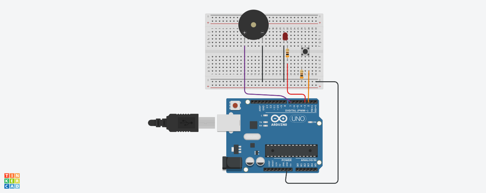

Projetos que fizemos na live no youtube na quarta-feira 20/05/2025
no canal Lucas Carvalho.
Vídeo completo:
https://www.youtube.com/watch?v=wtTWMjo_I3w&t=3907s

Passa ou Repassa
Com restart automático

Genius
Com placar e sem placar marcando o recorde

Labirinto Elétrico
Com 3 tentativas antes de disparar sirene

Sirene Maluca
Simples de montar apenas um interruptor, led, rele, sirene, já dá pra montar.

Esquemas Elétricos

Passa ou Repassa:
https://www.tinkercad.com/things/jZ3fM3vGLuC

Genius

https://www.tinkercad.com/things/0qD6xhnZ3Qz

Labirinto Elétrico

https://www.tinkercad.com/things/kknzMbMWFFC

Sirene Maluca

https://www.tinkercad.com/things/hsnihcJSezK